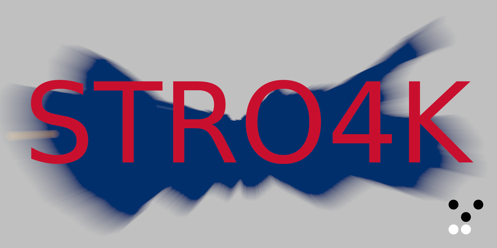

# STRO4K

A chess engine designed to fit into 4096 bytes. A successor to we4k.

## Current Plan
STRO4K targets 2700 elo (CCRL) on a single thread, while actually scaling with multiple threads (unlike we4k). This target is very unlikely to be met.

STRO is a non-4k version of STRO4K with more interface features, which is much easier to develop.

## Version 1.0
STRO4K 1.0 is available in the `version_1.0` branch. It has the extra feature of displaying the evaluation and principal variation during search.

## Building
Building STRO4K requires `nasm`, `xz` and [`sstrip`](https://github.com/aunali1/super-strip). A script is provided which attempts to download `sstrip` and build STRO4K.

```
./build4k <file_name> <thread_count> <hash_size_mb>
```

Or, for a default build with 4 threads, 16mb hash, and output file `STRO4K`:
```
./build4kdefault
```

STRO can be build using a Rust nightly compiler. By default, this includes an `asm` option that will use STRO4K search and eval code.
```
cargo build --release
```

## Current size
```
4092 bytes
```
## Features
* Search
    * Principal Variation Search
    * Transposition Table
    * Aspiration Windows
    * MVV-LVA Move ordering
    * Killer Heuristic
    * History Heuristic
    * Late Move Reductions
    * History Leaf Pruning
    * Null Move Pruning
    * Static Null Move Pruning
    * Futility Pruning
    * Lazy SMP
    * Internal Iterative Reductions
* Evaluation
    * Material
    * Mobility
    * Bishop Pair
    * Doubled Pawns
    * Passed Pawns
        * Blocked Passed Pawns
    * Isolated Pawns
    * Open Files
    * Rank and File Piece Tables
    * Pawn Shield
    * Tempo
    * Pieces attacked and defended by pawns

A neural network is planned.

## Questions
### Why is it called STRO4K?
```
Score of STRO4K-1.0 vs we4k-tcec: 146 - 28 - 26  [0.795] 200
...      STRO4K-1.0 playing White: 78 - 13 - 9  [0.825] 100
...      STRO4K-1.0 playing Black: 68 - 15 - 17  [0.765] 100
...      White vs Black: 93 - 81 - 26  [0.530] 200
Elo difference: 235.4 +/- 54.2, LOS: 100.0 %, DrawRatio: 13.0 %
Finished match
```

### How do you plan on fitting a neural network in 4096 bytes?
Hope.
